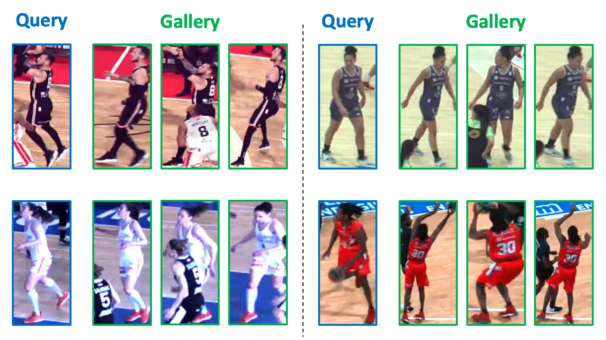

[](https://discord.gg/JvMQgMkpkm)
[](https://eval.ai/web/challenges/challenge-page/2076/overview)
[](http://mmsports.multimedia-computing.de/mmsports2023/challenge.html)

# The DeepSportradar Player Re-Identification Challenge (2023)


Welcome to the second edition of the DeepSportradar Player Re-Identification Challenge, which is one of the [ACM MMSports 2023 Workshop](http://mmsports.multimedia-computing.de/mmsports2023/index.html) challenges. 
An opportunity to publish, as well as a $1000 prize by competing on [EvalAI](https://eval.ai/web/challenges/challenge-page/2076/overview). 
See [this page](http://mmsports.multimedia-computing.de/mmsports2023/challenge.html) for more details.
In this challenge, participants will have to re-identify basketball players across multiple video frames captured from the same camera viewpoint at various time instants.
For that purpose, we provide our Synergy Re-Identification dataset with image crops of players, referees and coaches.
The dataset is split into a training, test and challenge set. 
Test and challenge sets are both split into queries and galleries, similar to traditional ReID datasets.
The testing-set should be used to evaluate your model, both on the public EvalAI leaderboard that provides the temporary ranking, and when communicating about your method.
The challenge-set will be used for the official challenge ranking.

## NEW CHALLENGE SET!

In response to the amazing performance achieved by participants last year, we have enriched the challenge set with a wider range of images, intensifying the difficulty level. This enhancement aims to create a more significant distinction in performance between participants, resulting in a more meaningful ranking that highlights the top performers.

The new challenge set will be released in the next two weeks! Stay tuned!!


If you use any DeepSportradar dataset in your research or wish to refer to the baseline results and discussion published in [our paper](https://arxiv.org/abs/2208.08190), please use the following BibTeX entry:

    @inproceedings{
    Van_Zandycke_2022,
    author = {Gabriel Van Zandycke and Vladimir Somers and Maxime Istasse and Carlo Del Don and Davide Zambrano},
	title = {{DeepSportradar}-v1: Computer Vision Dataset for Sports Understanding with High Quality Annotations},
	booktitle = {Proceedings of the 5th International {ACM} Workshop on Multimedia Content Analysis in Sports},
	publisher = {{ACM}},
    year = 2022,
	month = {oct},
    doi = {10.1145/3552437.3555699},
    url = {https://doi.org/10.1145%2F3552437.3555699}
    }
    
Maintainers: Vladimir Somers (v.somers@sportradar.com) Davide Zambrano (d.zambrano@sportradar.com) from Sportradar.

**NOTE this code is based on Open-reid repo: https://github.com/Cysu/open-reid.git"**

_Open-ReID is a lightweight library of person re-identification for research
purpose. It aims to provide a uniform interface for different datasets, a full
set of models and evaluation metrics, as well as examples to reproduce (near)
state-of-the-art results._

We want to thank the authors for providing this tool. This version applies some changes to the original code to specifically adapt it to the DeepSportradar Challenge on Person Re-Identification. 

This challenge started as a fork of the [player re-identification challenge](https://github.com/VIPriors/vipriors-challenges-toolkit/tree/master/re-identification) proposed in the [2nd VIPriors workshop challenges](https://vipriors.github.io/challenges/).

&nbsp;
<p align="center"></p>

## Installation

**Note that the file ```setup.py``` specifies the libraries version to use to run the code.**

Install [PyTorch](http://pytorch.org/). 

```shell
git clone https://github.com/DeepSportradar/player-reidentification-challenge.git
cd player-reidentification-challenge
pip install -e .
```

## Example

Run the following command to train a baseline model:
```shell
python baseline/synergyreid_baseline.py -b 64 -j 2 -a resnet50 --logs-dir logs/synergy-reid/
```

## Data

Person re-identification data are provided by [Synergy Sports](ttps://synergysports.com). 
Data come from short sequences of basketball games, each sequence is composed by 20 frames. 
For the test and challenge sets, the query images are persons taken at the first frame, while the gallery images are identities taken from the 2nd to the last frame.

The idea behind the baseline is to provide a quick introduction to how to handle the re-id data. 
Specifically, attention should be put on the dataset creation and the dataloaders.
The data files are provided under ```baseline/data/synergyreid/raw/synergyreid_data.zip```.

The baseline code extracts the raw files in the same directory and prepares the splits to use for training, test and challenge.

Specifically the dataset is divided as:

```shell
SynergyReID dataset loaded
  subset      | # ids | # images
  ---------------------------
  train       |   436 |     8569
  query test   |    50 |       50
  gallery test |    50 |      910
  traintest    |   486 |     9529
  ---------------------------
  query challenge  |   468 |      468
  gallery challenge |  8703 |     8703
```

Train and test identities can be merged (to improve performance) using the flag ```--combine-traintest```.

The image filename is divided in three numbers: the first one is the person-id; the second one is the sequence where the image was taken; and the third one is the frame number.

The test-set is divided in query and gallery to match the challenge-set format. With the flag ```--evaluate``` the distance matrix for the test set is also saved.
The identities of the gallery are NOT provided; gallery ids are just random.

## Submission on EvalAI
Submit your result through the [challenge page on the EvalAI platform](https://eval.ai/web/challenges/challenge-page/2076/overview).
You need to submit a _.csv_ file as the pairwise distance matrix of size (m+1) x (n+1), where m is the number of query images and n is the number of gallery images. 
The first row and the first column are the query and gallery ids respectively.
Query ids have to be ordered. 
Please check the example provided in the baseline ```baseline/synergyreid_baseline.py``` with the 'write_mat_csv' function.

Please refer to the challenge webpage for complete rules, timelines and awards: [https://deepsportradar.github.io/challenge.html](https://deepsportradar.github.io/challenge.html).

## Questions and remarks
If you have any question or remark regarding the challenge and related materials, please raise a GitHub issue in this repository, or contact us directly on [Discord](https://discord.gg/JvMQgMkpkm).
